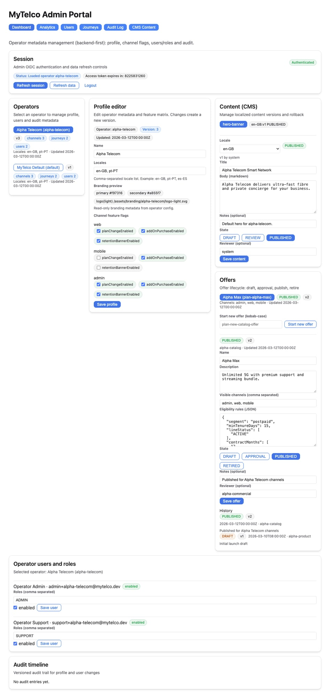
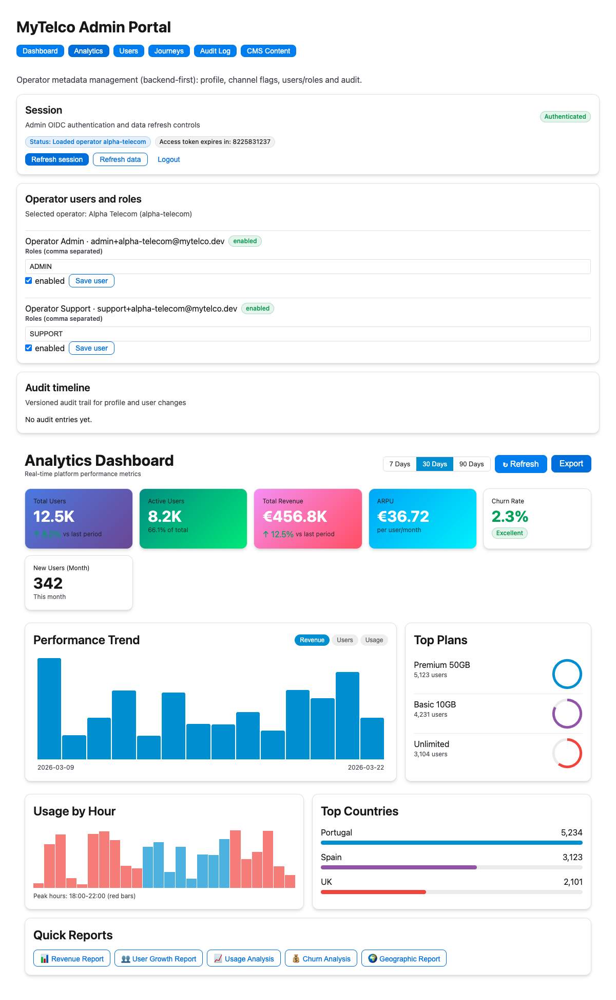
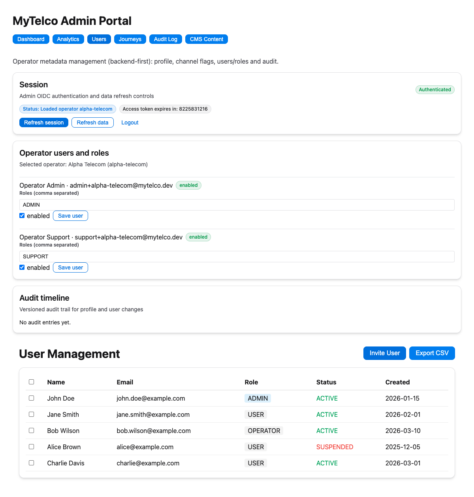
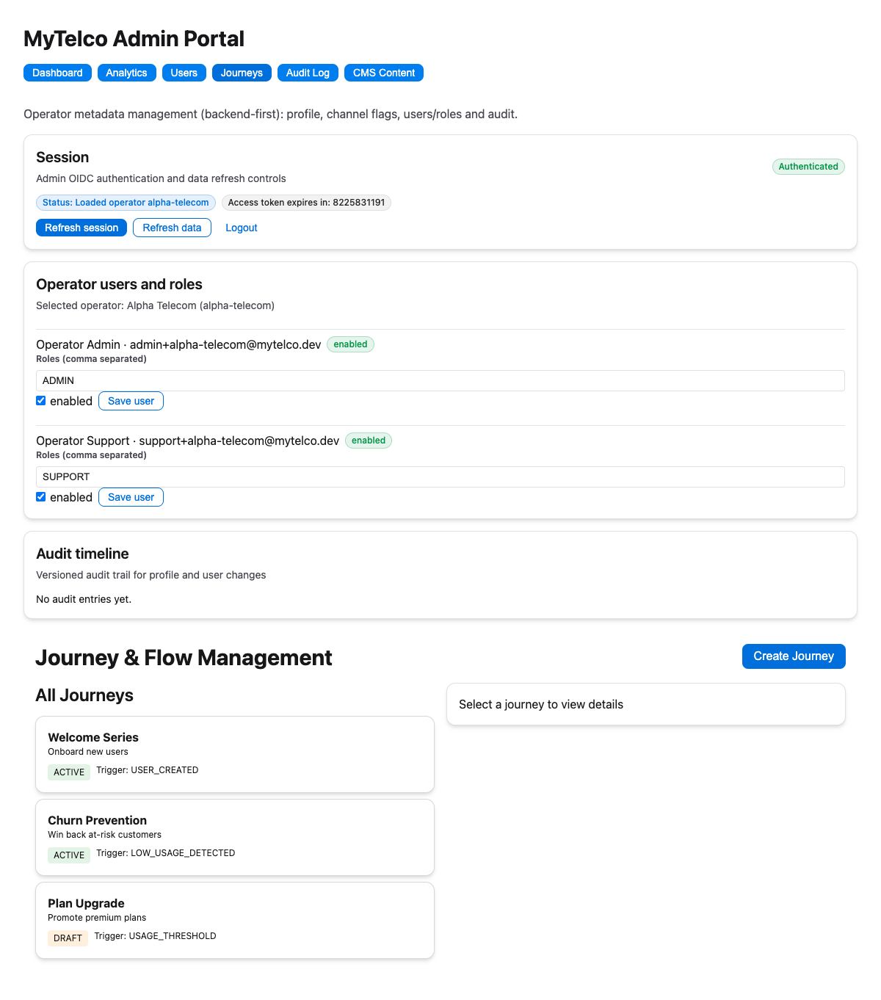
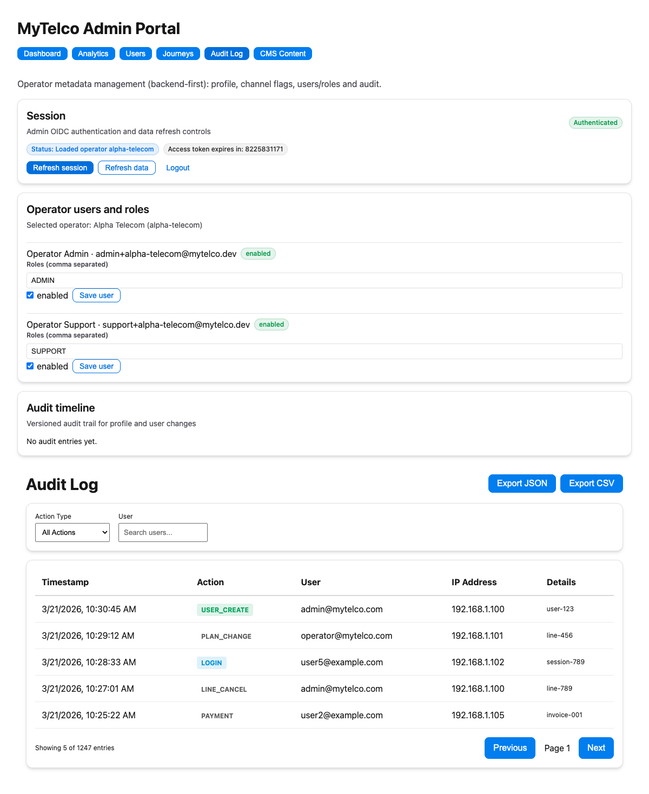
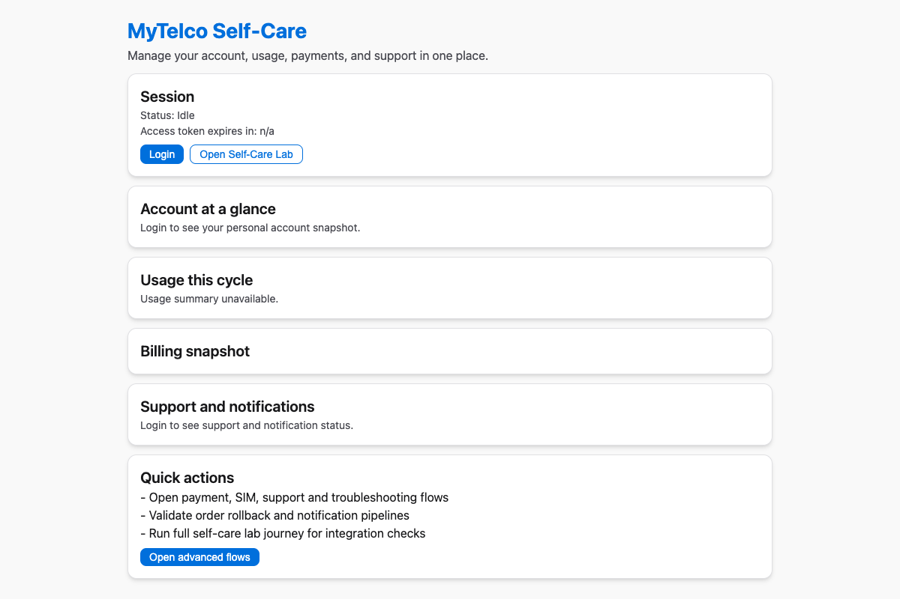
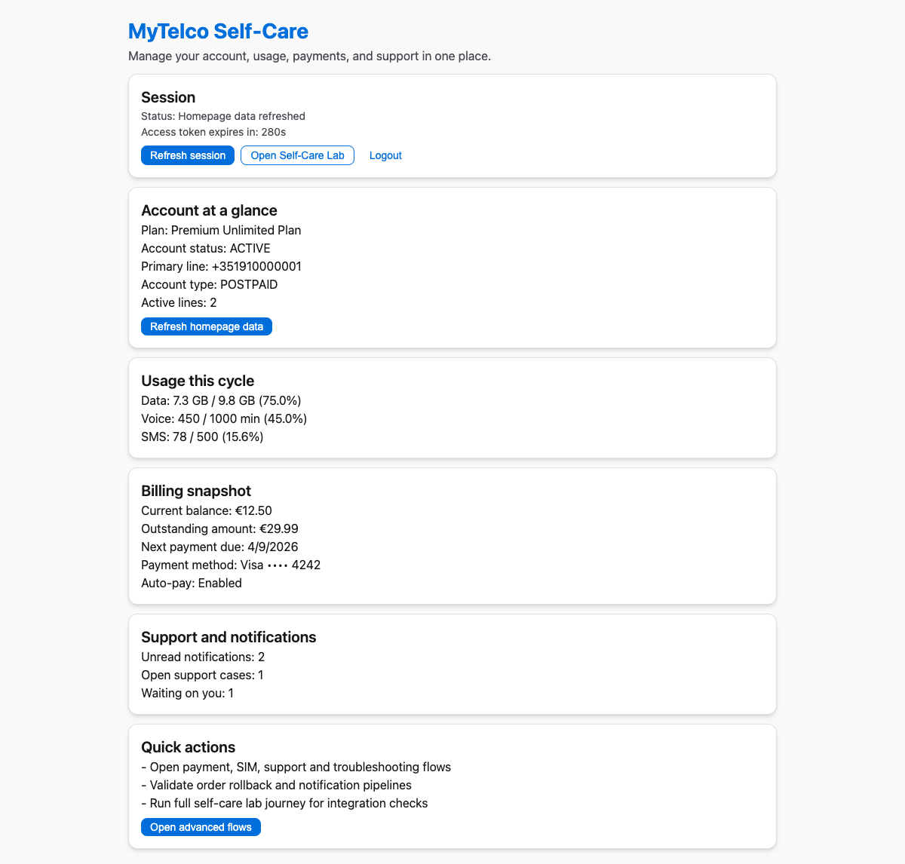
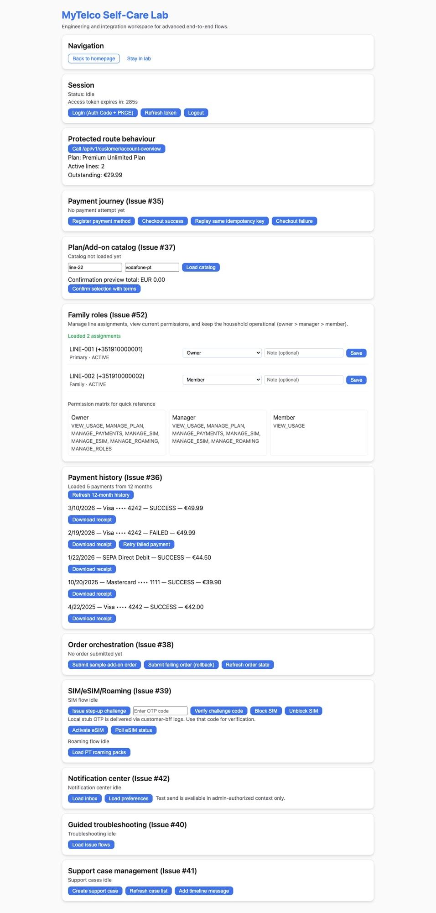

# User Journey Documentation

This document provides visual documentation of all user journeys implemented in the MyTelco White-Label platform.

---

## Table of Contents

1. [Mobile App - Customer Features](#mobile-app---customer-features)
   - [Profile & Account Management](#profile--account-management)
   - [Billing & Payment](#billing--payment)
   - [Line Lifecycle Management](#line-lifecycle-management)
   - [Settings & Preferences](#settings--preferences)
2. [Admin Portal - Operator Features](#admin-portal---operator-features)
   - [Dashboard](#dashboard)
   - [Analytics Dashboard](#analytics-dashboard)
   - [User Management](#user-management)
   - [Journey & Flow Management](#journey--flow-management)
   - [Audit Log](#audit-log)
3. [Web Portal - Customer Self-Service](#web-portal---customer-self-service)
   - [Login Page](#login-page)
   - [Customer Dashboard](#customer-dashboard)
   - [Self-Care Lab](#self-care-lab)

---

## Mobile App - Customer Features

### Profile & Account Management

**Feature ID:** #155  
**Path:** Mobile App → Profile Tab

#### Journey Steps

| Step | Screen | Description |
|------|--------|-------------|
| 1 | **Profile View** | User sees their name, email, phone number with edit option |
| 2 | **Edit Profile** | Form to update name, email, phone number |
| 3 | **Notification Preferences** | Toggles for push, SMS, email, marketing notifications |
| 4 | **Active Sessions** | List of logged-in sessions with device info |
| 5 | **Session Management** | Option to log out individual sessions |
| 6 | **Data Export (GDPR)** | Request download of personal data |
| 7 | **Account Deletion** | Confirm and delete account with warnings |

#### Screen Descriptions

```
┌─────────────────────────────┐
│  👤 Profile                │
├─────────────────────────────┤
│  ┌─────────────────────┐   │
│  │   Avatar/Photo      │   │
│  └─────────────────────┘   │
│                             │
│  Name: John Doe            │
│  Email: john@example.com   │
│  Phone: +351912345678      │
│                             │
│  [Edit Profile]            │
│                             │
│  ── Notifications ──       │
│  Push    [Toggle: ON]      │
│  SMS     [Toggle: ON]      │
│  Email   [Toggle: ON]      │
│  Marketing[Toggle: OFF]    │
│                             │
│  ── Sessions ──            │
│  📱 iPhone 14 - Lisbon    │
│     Active now             │
│  💻 MacBook - Lisbon       │
│     2 hours ago            │
│                             │
│  [Export My Data]          │
│  [Delete Account]          │
└─────────────────────────────┘
```

#### API Endpoints

- `GET /api/v1/customer/profile` - Fetch profile
- `PUT /api/v1/customer/profile` - Update profile
- `GET /api/v1/customer/profile/notifications` - Notification prefs
- `PUT /api/v1/customer/profile/notifications` - Update prefs
- `GET /api/v1/customer/profile/sessions` - Active sessions
- `DELETE /api/v1/customer/profile/sessions/{id}` - Logout session
- `GET /api/v1/customer/profile/export` - Request data export
- `DELETE /api/v1/customer/profile` - Delete account

---

### Billing & Payment

**Feature ID:** #156  
**Path:** Mobile App → Billing Tab

#### Journey Steps

| Step | Screen | Description |
|------|--------|-------------|
| 1 | **Payment Methods** | View saved cards with brand, last 4 digits |
| 2 | **Add Card** | Form to add new payment method |
| 3 | **Set Default** | Mark a card as primary payment |
| 4 | **Delete Card** | Remove payment method |
| 5 | **Billing Addresses** | Manage billing addresses |
| 6 | **Add Address** | New billing address form |
| 7 | **Auto-Pay Setup** | Enable automatic payments |
| 8 | **Schedule Day** | Choose payment date (1st/5th/10th/15th/20th/25th) |
| 9 | **Invoices** | View billing history |
| 10 | **Download Invoice** | Get PDF receipt |

#### Screen Descriptions

```
┌─────────────────────────────┐
│  💳 Billing                │
├─────────────────────────────┤
│  [Cards] [Address]         │
│  [Auto-Pay] [Invoices]    │
├─────────────────────────────┤
│  Payment Methods           │
│  ─────────────────────────  │
│  ┌─────────────────────┐   │
│  │ 💳 VISA •••• 4242 │   │
│  │    Default         │   │
│  │ Exp: 12/2027       │   │
│  └─────────────────────┘   │
│  ┌─────────────────────┐   │
│  │ 💳 Mastercard •••• │   │
│  │    5555            │   │
│  │ Exp: 06/2026       │   │
│  └─────────────────────┘   │
│                             │
│  [+ Add New Card]          │
└─────────────────────────────┘
```

```
┌─────────────────────────────┐
│  📄 Invoices               │
├─────────────────────────────┤
│  ┌─────────────────────┐   │
│  │ INV-2026-001  €35.99│   │
│  │ Paid  •  Mar 15     │   │
│  │ [Download PDF]      │   │
│  └─────────────────────┘   │
│  ┌─────────────────────┐   │
│  │ INV-2026-002  €35.99│   │
│  │ Pending  •  Apr 15  │   │
│  │ [Download PDF]      │   │
│  └─────────────────────┘   │
└─────────────────────────────┘
```

#### API Endpoints

- `GET /api/v1/customer/billing/payment-methods` - List payment methods
- `POST /api/v1/customer/billing/payment-methods` - Add payment method
- `DELETE /api/v1/customer/billing/payment-methods/{id}` - Delete payment method
- `PUT /api/v1/customer/billing/payment-methods/{id}/default` - Set default
- `GET /api/v1/customer/billing/addresses` - List addresses
- `POST /api/v1/customer/billing/addresses` - Add address
- `DELETE /api/v1/customer/billing/addresses/{id}` - Delete address
- `GET /api/v1/customer/billing/autopay` - Get auto-pay config
- `PUT /api/v1/customer/billing/autopay` - Update auto-pay
- `GET /api/v1/customer/billing/invoices` - List invoices

---

### Line Lifecycle Management

**Feature ID:** #157  
**Path:** Mobile App → Lines Tab

#### Journey Steps

| Step | Screen | Description |
|------|--------|-------------|
| 1 | **Lines List** | View all phone lines (active, pending, cancelled) |
| 2 | **Line Details** | See phone number, plan, SIM type |
| 3 | **eSIM Activation** | Display QR code for eSIM setup |
| 4 | **SIM Delivery** | Track physical SIM delivery status |
| 5 | **Add New Line** | Get new number or port existing |
| 6 | **Plan Change** | Upgrade/downgrade with proration preview |
| 7 | **Cancel Line** | Cancel with retention offer |

#### Screen Descriptions

```
┌─────────────────────────────┐
│  📱 My Lines               │
├─────────────────────────────┤
│  [+ Add Line]              │
├─────────────────────────────┤
│  ┌─────────────────────┐   │
│  │ +351912345678      │   │
│  │ Premium 50GB • eSIM│   │
│  │ ● Active           │   │
│  │ [View Details]     │   │
│  └─────────────────────┘   │
│  ┌─────────────────────┐   │
│  │ +351912345679      │   │
│  │ Basic 10GB • SIM   │   │
│  │ ○ Shipped          │   │
│  │ Est. Delivery: Mar 25│
│  └─────────────────────┘   │
└─────────────────────────────┘
```

```
┌─────────────────────────────┐
│  📱 Line Details           │
├─────────────────────────────┤
│  ← Back                   │
│  +351912345678             │
│  Premium 50GB - €35.99/mo  │
├─────────────────────────────┤
│  📶 eSIM Activation        │
│  ─────────────────────────  │
│  ┌─────────────────────┐   │
│  │                    │   │
│  │   [QR CODE]       │   │
│  │                    │   │
│  └─────────────────────┘   │
│  Or enter: LMNK-ABCD-EFGH  │
│                             │
│  [Change Plan]             │
│  [Cancel Line]             │
└─────────────────────────────┘
```

#### API Endpoints

- `GET /api/v1/customer/lines` - List all lines
- `GET /api/v1/customer/lines/{id}` - Get line
- `GET /api/v1/customer/lines/{id}/details` - Line details with usage
- `POST /api/v1/customer/lines` - Add new line
- `POST /api/v1/customer/lines/{id}/cancel` - Cancel line
- `GET /api/v1/customer/lines/{id}/proration` - Proration preview
- `POST /api/v1/customer/lines/{id}/change-plan` - Change plan

---

### Settings & Preferences

**Feature ID:** #159  
**Path:** Mobile App → Settings Tab

#### Journey Steps

| Step | Screen | Description |
|------|--------|-------------|
| 1 | **Language** | Select locale (en-GB, pt-PT, es-ES, etc.) |
| 2 | **Theme** | Light/Dark/System theme toggle |
| 3 | **Experiments** | View active A/B tests |
| 4 | **Push Notifications** | Enable/disable push |
| 5 | **Usage Thresholds** | Configure alert percentages |

#### Screen Descriptions

```
┌─────────────────────────────┐
│  ⚙️ Settings               │
├─────────────────────────────┤
│  [Language] [Theme]        │
│  [Alerts] [Experiments]    │
├─────────────────────────────┤
│  Language                  │
│  ─────────────────────────  │
│  🇬🇧 English (UK)  ✓      │
│  🇵🇹 Portuguese (PT)      │
│  🇪🇸 Spanish (ES)         │
│  🇫🇷 French (FR)          │
├─────────────────────────────┤
│  Theme                     │
│  ─────────────────────────  │
│  ☀️ Light    ○            │
│  🌙 Dark     ●            │
│  💻 System   ○            │
└─────────────────────────────┘
```

---

## Admin Portal - Operator Features

### Dashboard

**Feature ID:** #158  
**Path:** Admin Portal → Dashboard Tab

#### Journey Steps

| Step | Screen | Description |
|------|--------|-------------|
| 1 | **Session Management** | View auth status, refresh token, logout |
| 2 | **Operators List** | Select operator to manage |
| 3 | **Profile Editor** | Edit operator metadata, locales, branding, channel flags |
| 4 | **CMS Content** | Manage localized content versions |
| 5 | **Offers** | Manage offer lifecycle (draft, approval, publish, retire) |
| 6 | **Users & Roles** | Manage operator users and roles |
| 7 | **Audit Timeline** | View versioned audit trail |

#### Screenshot



---

### Analytics Dashboard

**Feature ID:** #158  
**Path:** Admin Portal → Analytics Tab

#### Journey Steps

| Step | Screen | Description |
|------|--------|-------------|
| 1 | **Overview KPIs** | Total users, revenue, ARPU, churn |
| 2 | **Revenue Trend** | Interactive chart with date range |
| 3 | **User Analytics** | Growth charts, top plans |
| 4 | **Usage Patterns** | Usage by hour heatmap |
| 5 | **Geographic** | Top countries by users |
| 6 | **Export** | Download reports (CSV/JSON) |

#### Screenshot



---

### User Management

**Feature ID:** #158  
**Path:** Admin Portal → Users Tab

#### Journey Steps

| Step | Screen | Description |
|------|--------|-------------|
| 1 | **User List** | Searchable, filterable table |
| 2 | **Filters** | By role, status, date range |
| 3 | **Bulk Select** | Select multiple users |
| 4 | **Bulk Actions** | Activate, suspend, delete |
| 5 | **Invite User** | Send email invitation |
| 6 | **Export** | Download user list |

#### Screenshot



---

### Journey & Flow Management

**Feature ID:** #158  
**Path:** Admin Portal → Journeys Tab

#### Journey Steps

| Step | Screen | Description |
|------|--------|-------------|
| 1 | **Journey List** | All journeys with status |
| 2 | **Journey Details** | Flow visualization |
| 3 | **Stats** | Triggered, completed, abandoned |
| 4 | **Create Journey** | Define trigger and steps |
| 5 | **Publish** | Activate journey |
| 6 | **Edit/Pause** | Manage active journeys |

#### Screenshot



---

### Audit Log

**Feature ID:** #158  
**Path:** Admin Portal → Audit Tab

#### Journey Steps

| Step | Screen | Description |
|------|--------|-------------|
| 1 | **Log View** | Paginated activity log |
| 2 | **Filters** | By action type, user, date |
| 3 | **Expand Details** | View full JSON changes |
| 4 | **Live Refresh** | Auto-refresh toggle |
| 5 | **Export** | Download audit logs |

#### Screenshot



---

## Web Portal - Customer Self-Service

**Feature ID:** #159  
**Path:** Web Portal (http://localhost:3000)

### Login Page

#### Journey Steps

| Step | Screen | Description |
|------|--------|-------------|
| 1 | **Landing** | User arrives at MyTelco Self-Care portal |
| 2 | **Login** | Click Login to authenticate via OIDC |
| 3 | **Auth** | Redirect to Keycloak, enter credentials |
| 4 | **Callback** | Return to portal with auth code |
| 5 | **Session** | Tokens stored, API calls authorized |

#### Screenshot



---

### Customer Dashboard

#### Journey Steps

| Step | Screen | Description |
|------|--------|-------------|
| 1 | **Session Status** | View auth token expiry, refresh or logout |
| 2 | **Account Overview** | View personal account snapshot |
| 3 | **Usage This Cycle** | Data, voice, SMS consumption |
| 4 | **Billing** | Current balance, next payment, payment method |
| 5 | **Support** | Notifications, open cases, pending actions |
| 6 | **Quick Actions** | Shortcuts to common flows |

#### Screenshot



---

### Self-Care Lab

#### Journey Steps

| Step | Screen | Description |
|------|--------|-------------|
| 1 | **Advanced Flows** | Engineering workspace for E2E testing |
| 2 | **Payment Testing** | Register payment, checkout success/failure |
| 3 | **Catalog** | Load plans, confirm selections |
| 4 | **Family Roles** | Manage line assignments (owner/manager/member) |
| 5 | **Order History** | View 12-month payment history |
| 6 | **SIM Management** | Issue challenge, block/unblock, eSIM activation |
| 7 | **Roaming** | Load and manage roaming packs |
| 8 | **Notifications** | Load inbox and preferences |
| 9 | **Support Cases** | Create and manage support tickets |
| 10 | **Troubleshooting** | Load issue flows |

#### Screenshot



---

## API Summary

| Feature | Base Path | Methods |
|---------|-----------|---------|
| Profile | `/api/v1/customer/profile` | GET, PUT |
| Notifications | `/api/v1/customer/profile/notifications` | GET, PUT |
| Sessions | `/api/v1/customer/profile/sessions` | GET, DELETE |
| Billing | `/api/v1/customer/billing` | CRUD |
| Lines | `/api/v1/customer/lines` | CRUD |
| Analytics | `/api/v1/admin/analytics` | GET |
| Users | `/api/v1/admin/users` | GET, POST, Bulk |
| Journeys | `/api/v1/admin/journeys` | CRUD |
| Audit | `/api/v1/admin/audit` | GET |

---

*Last Updated: 2026-03-22*
*Document Version: 1.0*
